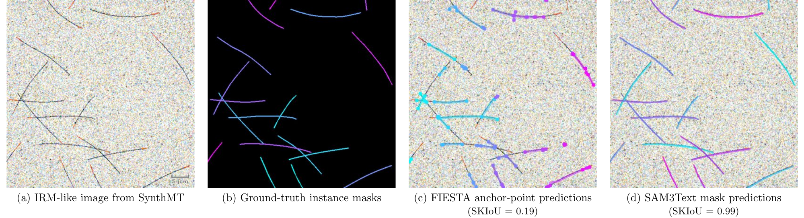
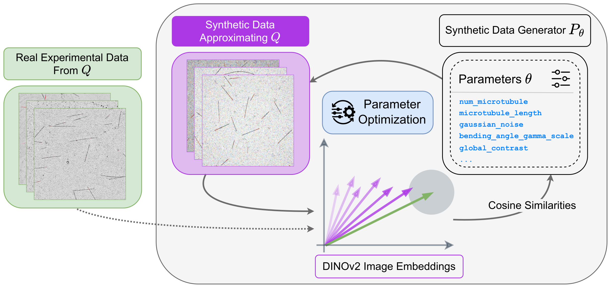

# SynthMT: Synthetic Data Enables Human-Grade Microtubule Analysis with foundation models for segmentation

[](https://huggingface.co/datasets/HTW-KI-Werkstatt/SynthMT)
[](https://DATEXIS.github.io/SynthMT-project-page)
[](https://biorxiv.org/coming-soon)
[](LICENSE)



**Figure: The SynthMT instance segmentation benchmark evaluates methods on synthetic IRM-like images containing microtubules.**
(a) Synthetic image mimicking IRM of *in vitro* reconstituted MTs nucleated from fixed seeds (red), reproducing key mechanical and geometrical properties such as filament length and curvature.
(b) Our pipeline generates accompanying ground-truth instance masks for quantitative evaluation.
(c) The classical FIESTA algorithm demonstrates typical failure modes: filament fragmentation, incomplete segmentation, and artifacts at intersections.
(d) SAM3 guided by a simple text prompt ("thin line") produces precise, human-grade segmentation.

## Overview

**SynthMT** is a synthetic benchmark dataset for evaluating instance segmentation methods on *in vitro* microtubule (MT) images. Studying microtubules and their mechanical properties is central to understanding intracellular transport, cell division, and drug action. While important, experts still need to spend many hours manually segmenting these filamentous structures.

This repository provides:

- 🔬 **Synthetic data generation pipeline** that produces realistic MT images with ground-truth instance masks
- 🎯 **Parameter optimization** using DINOv2 embeddings to align synthetic images with real microscopy data
- 📊 **SynthMT benchmark dataset** tuned on real IRM microscopy images (no human annotations required)
- 🧪 **Evaluation framework** for benchmarking segmentation methods in zero-shot and few-shot settings

### Key Findings

Our benchmark evaluates nine fully automated methods for MT analysis. Key results:

- Classical algorithms and most of the current foundation models struggle on *in vitro* MT IRM images that humans perceive as visually simple
- **SAM3** (text-prompted as "SAM3Text") achieves **human-grade performance** after hyperparameter optimization on only 10 random SynthMT images

## 🔗 Resources

| Resource       | Link                                                                                                                                      |
| -------------- | ----------------------------------------------------------------------------------------------------------------------------------------- |
| 📄 Paper        | [bioRxiv](https://www.biorxiv.org/content/10.64898/2026.01.09.698597v2)                                                                   |
| 🌐 Project Page | [DATEXIS.github.io/SynthMT-project-page](https://DATEXIS.github.io/SynthMT-project-page) – **Interactive demos for all evaluated models** |
| 🤗 Dataset      | [huggingface.co/datasets/HTW-KI-Werkstatt/SynthMT](https://huggingface.co/datasets/HTW-KI-Werkstatt/SynthMT)                              |
| 💻 Code         | This repository                                                                                                                           |

## Table of Contents

- [Installation](#installation)
- [Quick Start](#quick-start)
- [Example Notebooks](#example-notebooks)
- [Dataset](#dataset)
- [Synthetic Data Generation](#synthetic-data-generation)
- [Configuration](#configuration)
- [Testing](#testing)
- [Citation](#citation)
- [License](#license)

## Installation

We recommend using **[uv](https://github.com/astral-sh/uv)** for fast, reliable Python package management. uv is significantly faster than pip and provides better dependency resolution. It works seamlessly within conda environments.
As python version, we recommend using Python 3.11.

### Option 1: Using Conda + uv (Recommended)

This is the recommended approach as it provides conda's environment management (required for µSAM) with uv's fast package installation.

```bash
# Install uv if you haven't already
curl -LsSf https://astral.sh/uv/install.sh | sh

# Clone the repository
git clone https://github.com/ml-lab-htw/SynthMT.git
cd SynthMT

# Create conda environment from environment.yml
conda env create -f environment.yml
conda activate synth_mt

# Use uv for fast package installation within conda
uv pip install -e .

# IMPORTANT: For SAM3 support, install transformers pre-release
uv pip install -U transformers --pre
```

### Option 2: Using Conda + pip

```bash
# Clone the repository
git clone https://github.com/ml-lab-htw/SynthMT.git
cd SynthMT

# Create conda environment from environment.yml (includes micro_sam)
conda env create -f environment.yml
conda activate synth_mt

# Install the package
pip install -e .

# IMPORTANT: For SAM3 support, install transformers pre-release
pip install -U transformers --pre
```

### Option 3: Using pip/uv only (without microSAM)

If you don't need microSAM (µSAM), you can use pip or uv directly:

```bash
# Clone the repository
git clone https://github.com/ml-lab-htw/SynthMT.git
cd SynthMT

# Create a virtual environment
python -m venv .venv
source .venv/bin/activate  # On Windows: .venv\Scripts\activate

# Install with uv (faster) or pip
uv pip install -e ".[models]"
# OR
pip install -e ".[models]"

# IMPORTANT: For SAM3 support, install transformers pre-release
pip install -U transformers --pre
```

### SAM3 Support

SAM3 is a very recent model that requires the pre-release version of *transformers:*

```bash
pip install -U transformers --pre
```

### CellSAM Support

CellSAM required small adaptations/fixes to run within this pipeline. While our upstream pull request is pending, please install and use our fork of CellSAM:

```bash
pip install git+https://github.com/mario-koddenbrock/cellSAM.git
```

The fork contains the compatibility fixes; once the upstream PR is merged you can switch back to the official package.

### Running FIESTA (MATLAB)

If you want to run FIESTA in script mode, please use our fork (clone or browse): [ml-lab-htw/FIESTA on GitHub](https://github.com/ml-lab-htw/FIESTA.git) in which we modified the original project.

FIESTA is a MATLAB application. From Python you call it using the MATLAB Engine API for Python; see the official MathWorks guide: [MATLAB Engine API for Python](https://www.mathworks.com/help/matlab/matlab-engine-for-python.html).

We developed and tested the integration with **MATLAB R2025b**.

**Important**: the Python integration expects the FIESTA code to be available at `./fiesta` (relative to the working directory of the SynthMT process). The simplest approach is to clone the fork into the SynthMT project root so the folder appears as `SynthMT/fiesta` (for example: `git clone https://github.com/ml-lab-htw/FIESTA.git /path/to/SynthMT/fiesta`). If you place it elsewhere, update paths or the working directory accordingly.

#### Quick start

1. Clone the forked FIESTA repository (replace `/path/to/SynthMT/fiesta` with the target path on your machine):

```bash
git clone https://github.com/ml-lab-htw/FIESTA.git /path/to/SynthMT/fiesta
```

2. Install the MATLAB Engine for Python on the machine that has MATLAB installed (run once). Use the Python interpreter/environment you will run your code from. For MATLAB R2025b the engine sources are under the app bundle:

```bash
cd /Applications/MATLAB_R2025b.app/extern/engines/python
python3 -m pip install .
```

3. Verify the engine was installed into the same Python environment you will use (for example, your `conda` environment `synth_mt`):

```bash
# activate the environment you plan to run from, then try importing the engine interactively
conda activate synth_mt
python -c "import matlab.engine; print('MATLAB engine available')"
```

#### Notes & troubleshooting

- The MATLAB Engine must be installed into the same Python interpreter/environment you use to run your scripts. If you use `conda activate synth_mt`, install the engine while that environment is active.
- If your MATLAB version or install location differs from `R2025b`, adapt the `cd` path accordingly.
- For details about available MATLAB entry points and how we adapted FIESTA for script mode, see the forked repository: https://github.com/ml-lab-htw/FIESTA.git

### Optional Model Dependencies

Some models require additional setup:

| Model               | Installation                                                       | Notes                                                                                                                                                                                                                                                                                                                                                                                      |
| ------------------- | ------------------------------------------------------------------ | ------------------------------------------------------------------------------------------------------------------------------------------------------------------------------------------------------------------------------------------------------------------------------------------------------------------------------------------------------------------------------------------ |
| **microSAM (µSAM)** | `conda install -c conda-forge micro_sam`                           | Requires conda                                                                                                                                                                                                                                                                                                                                                                             |
| **CellSAM**         | `pip install git+https://github.com/mario-koddenbrock/cellSAM.git` | Requires `DEEPCELL_ACCESS_TOKEN` in `.env. Adaptations pending upstream — use the fork above until the pull request is merged.`                                                                                                                                                                                                                                                            |
| **TARDIS**          | `pip install tardis-em==0.3.10`                                    | TARDIS pinned to **0.3.10** (recommended)                                                                                                                                                                                                                                                                                                                                                  |
| **SAM3**            | `pip install -U transformers --pre`                                | Pre-release transformers, needs granted access on [Huggingface](https://huggingface.co/facebook/sam3)                                                                                                                                                                                                                                                                                      |
| **FIESTA (MATLAB)** | `git clone https://github.com/ml-lab-htw/FIESTA.git ./fiesta`      | MATLAB app (tested with **R2025b**). Install the [MATLAB Engine API for Python](https://www.mathworks.com/help/matlab/matlab-engine-for-python.html). After cloning, install the engine (example): `cd /Applications/MATLAB_R2025b.app/extern/engines/python && python3 -m pip install .`. Clone into the SynthMT root as `./fiesta` so `synth_mt/benchmark/models/fiesta.py` can find it. |

### Apple Silicon Compatibility

- **TensorFlow/Keras conflicts**: If you encounter issues on Apple Silicon, run: `pip uninstall pyarrow`

## Quick Start

### Load the SynthMT Dataset

```python
from datasets import load_dataset

# Load the dataset from HuggingFace
ds = load_dataset("HTW-KI-Werkstatt/SynthMT", split="train")

# Access a sample
sample = ds[0]
image = sample["image"]  # PIL Image
masks = sample["mask"]   # List of PIL Images (instance masks)
```

### Generate Synthetic Data

```python
from synth_mt.config.synthetic_data import SyntheticDataConfig
from synth_mt.data_generation.video import generate_video

# Load configuration
cfg = SyntheticDataConfig.from_json("examples/synthetic_data_example.json")

# Generate video with masks
generate_video(cfg, base_output_dir="output/")
```

## Example Notebooks

We provide detailed Jupyter notebooks demonstrating different aspects of the pipeline:

| Notebook                                                                                  | Description                                                                                                                                                                                                                               |
| ----------------------------------------------------------------------------------------- | ----------------------------------------------------------------------------------------------------------------------------------------------------------------------------------------------------------------------------------------- |
| [`example_load_SynthMT.ipynb`](examples/example_load_SynthMT.ipynb)                       | **Load and visualize the SynthMT dataset** from HuggingFace. Shows how to decompose samples into images and masks, convert to NumPy arrays, and create overlay visualizations.                                                            |
| [`example_evaluate_model.ipynb`](examples/example_evaluate_model.ipynb)                   | **Evaluate segmentation models** on SynthMT. Load models via ModelFactory, run predictions, and compute segmentation metrics (SkIoU, F1, AP) and downstream metrics (count, length, curvature distributions).                             |
| [`example_single_frame_generation.ipynb`](examples/example_single_frame_generation.ipynb) | **Detailed walkthrough of the image generation pipeline**. Explains the two-step stochastic process: (1) geometry generation with polylines and stochastic curvature, and (2) image rendering with PSF convolution, noise, and artifacts. |
| [`example_generate_synthetic_data.ipynb`](examples/example_generate_synthetic_data.ipynb) | **Generate synthetic video data** from a JSON configuration. Includes microtubule dynamics (growing, shrinking, pausing, rescue) and produces images, masks, videos, and preview animations.                                              |
| [`example_optimize_synthetic_data.ipynb`](examples/example_optimize_synthetic_data.ipynb) | **Tune generation parameters θ** to match real microscopy images. Uses DINOv2 embeddings and Optuna for optimization without requiring ground-truth annotations.                                                                          |
| [`example_full_pipeline.ipynb`](examples/example_full_pipeline.ipynb)                     | **Complete end-to-end pipeline** for applying SynthMT to your own data. Tune synthetic data, optimize SAM3Text hyperparameters, and compare zero-shot vs HPO performance—all without manual annotations.                                  |

## Dataset

The **SynthMT dataset** is hosted on HuggingFace and contains synthetic IRM-like microtubule images with instance segmentation masks.

### Dataset Structure

Each sample contains:
- `image`: RGB microscopy image (PIL Image)
- `mask`: List of binary instance masks (one per microtubule)

### Loading the Dataset

```python
from datasets import load_dataset
import numpy as np

# Load dataset
ds = load_dataset("HTW-KI-Werkstatt/SynthMT", split="train")

# Convert to NumPy
sample = ds[0]
img_array = np.array(sample["image"].convert("RGB"))  # (H, W, 3)
mask_stack = np.stack([np.array(m.convert("L")) for m in sample["mask"]], axis=0)  # (N, H, W)
```

## Synthetic Data Generation

### Parameter Optimization



**Figure: Optimizing θ aligns synthetic image distributions with real, annotation-free microscopy data.**
Real IRM images (left) and synthetic images (center) are embedded using DINOv2. The parametric generator $P_\theta$ (right) creates images by sampling from distributions governing geometric properties (filament count, length, curvature) and imaging characteristics (PSF, noise, artifacts, contrast, distortions), all controlled by θ. An optimization loop iteratively refines θ by maximizing cosine similarity between real and synthetic embeddings, ensuring that synthetic images match the statistical properties and visual characteristics of experimental data.

### Mathematical Framework

The generation pipeline follows a **two-step stochastic process** that produces synthetic images $I \sim P_\theta(I)$ conditioned on parameter set $\theta$:

#### Step 1: Microtubule Geometry

Each MT is modeled as a polyline with $n$ segments. Segment lengths are sampled from a Gaussian distribution, and curvature is introduced through stochastic evolution of bend angles using a Gamma distribution. This yields smoothly curved filaments that replicate real MT morphology.

#### Step 2: Image Rendering

1. **Physical Rendering**: Binary masks are convolved with the Point Spread Function (PSF), scaled by contrast and background intensity
2. **Artifact Simulation**: Distractor spots (circular, irregular structures) are added
3. **Noise Addition**: Signal-dependent (Poisson) and signal-independent (Gaussian) noise
4. **Global Distortions**: Vignetting, blur, and contrast variations

### Command-Line Usage

```bash
# Generate a single video
python scripts/generate_synthetic_data.py \
    -c ./config/synthetic_config.json \
    -o ./data/generated \
    --count 1

# Generate 10 videos sequentially
python scripts/generate_synthetic_data.py \
    -c ./config/synthetic_config.json \
    -o ./data/generated \
    --count 10
```

### CLI Arguments

| Argument              | Shorthand | Required | Description                                 |
| --------------------- | --------- | -------- | ------------------------------------------- |
| `--config <path>`     | `-c`      | Yes      | Path to the JSON configuration file         |
| `--output-dir <path>` | `-o`      | Yes      | Output directory for generated data         |
| `--ids <id1> <id2>`   |           | No       | Specific video IDs to generate              |
| `--count <number>`    |           | No       | Number of videos to generate                |
| `--start-id <number>` |           | No       | Starting ID for sequential generation       |
| `--save-config`       |           | No       | Save configuration copy for reproducibility |

## Configuration

The generation is controlled by a JSON configuration file. Parameters are grouped by their effect:

| Category               | Description                    | Key Parameters                                                    |
| ---------------------- | ------------------------------ | ----------------------------------------------------------------- |
| **Core Properties**    | Video dimensions and duration  | `img_size`, `fps`, `num_frames`                                   |
| **MT Dynamics**        | Growth, shrinkage, catastrophe | `growth_speed`, `shrink_speed`, `catastrophe_prob`, `rescue_prob` |
| **Filament Structure** | Segment length and bending     | `max_num_wagons`, `wagon_length_*`, `max_angle`                   |
| **Population**         | Number and placement of MTs    | `num_microtubule`, `microtubule_min_dist`                         |
| **Optics & PSF**       | Blur and sharpness             | `psf_sigma_h`, `psf_sigma_v`, `global_blur_sigma`                 |
| **Noise Model**        | Poisson and Gaussian noise     | `quantum_efficiency`, `gaussian_noise`                            |
| **Artifacts**          | Background particles           | `fixed_spots`, `moving_spots`, `random_spots`                     |

See [`examples/synthetic_data_example.json`](examples/synthetic_data_example.json) for a complete configuration example.

## Testing

Some tests require access to the Hugging Face Hub. Set the environment variable:

```bash
export HUGGING_FACE_HUB_TOKEN=your_token_here
```

Or create a `.env` file:
```
HUGGING_FACE_HUB_TOKEN=your_token_here
```

Run tests:
```bash
pytest
```

## Citation

If you use SynthMT in your research, please cite our paper:

```bibtex
@article{koddenbrock2026synthetic,
    author = {Koddenbrock, Mario and Westerhoff, Justus and Fachet, Dominik and Reber, Simone and Gers, Felix A. and Rodner, Erik},
    title = {Synthetic data enables human-grade microtubule analysis with foundation models for segmentation},
    elocation-id = {2026.01.09.698597},
    year = {2026},
    doi = {10.64898/2026.01.09.698597},
    publisher = {Cold Spring Harbor Laboratory},
    URL = {https://www.biorxiv.org/content/early/2026/01/12/2026.01.09.698597},
    eprint = {https://www.biorxiv.org/content/early/2026/01/12/2026.01.09.698597.full.pdf},
    journal = {bioRxiv}
}
```

## License

This project is licensed under the MIT License. See the [LICENSE](LICENSE) file for details.

## Contributing

Contributions are welcome! Please feel free to submit a pull request or open an issue.

---

# 🙏 Acknowledgements

Our work is funded by the Deutsche Forschungsgemeinschaft (DFG, German Research Foundation) Project-ID 528483508 - FIP 12. We would like to thank Dominik Fachet and Gil Henkin from the Reber lab for providing data, and also thank the further study participants Moritz Becker, Nathaniel Boateng, and Miguel Aguilar. The Reber lab thanks staff at the Advanced Medical Bioimaging Core Facility (Charité, Berlin) for imaging support and the Max Planck Society for funding. Furthermore, we thank Kristian Hildebrand and Chaitanya A. Athale (IISER Pune, India) and his lab for helpful discussions


---

[Project Page](https://DATEXIS.github.io/SynthMT-project-page) • [Dataset](https://huggingface.co/datasets/HTW-KI-Werkstatt/SynthMT) • [Paper]([https://biorxiv.org/coming-soon](https://www.biorxiv.org/content/10.64898/2026.01.09.698597v2))
